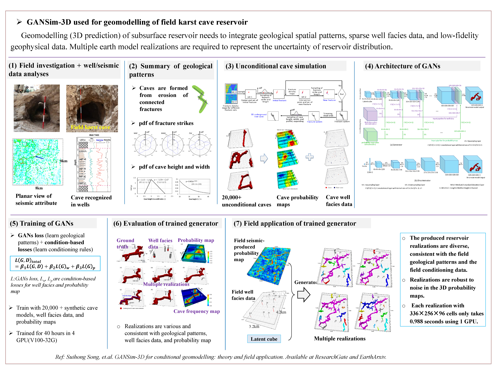

## GANSim-3D for conditional geomodelling: theory and field application


 
**Picture:** *Workflow of field cave reservoir geomodelling using GANSim*

This repository contains the official TensorFlow implementation of the following paper:

> **GANSim-3D for conditional geomodelling: theory and field application**<br>
> Suihong Song (PengCheng Lab, Stanford, and CUPB), Tapan Mukerji (Stanford), Jiagen Hou (CUPB), Dongxiao Zhang (PengCheng Lab), Xinrui Lyu (Sinopec) <br>
> CUPB: China University of Petroleum - Beijing

> Available at my ResearchGate personal profile (https://www.researchgate.net/profile/Suihong-Song)
>
> **Abstract:** We present a Generative Adversarial Networks (GANs)-based 3D reservoir simulation framework, GANSim-3D, where the generator is progressively trained to capture geological patterns and relationships between various input conditioning data and output earth models and is thus able to directly produce multiple 3D realistic and conditional earth models from given conditioning data. Conditioning data can include 3D sparse well facies data, probability maps, and global features like facies proportion. The generator only includes 3D convolutional layers, and once trained on a dataset consisting of small-size data cubes, it can be used for geomodelling of 3D reservoirs of large arbitrary sizes by simply extending the inputs. To illustrate how GANSim-3D is practically used and to verify GANSim-3D, a field karst cave reservoir in Tahe area of China is used as an example. The 3D well facies data and 3D probability map of caves obtained from geophysical interpretation are taken as conditioning data. First, we create training, validation, and test datasets consisting of 64×64×64-size 3D cave facies models integrating field geological patterns, 3D well facies data, and 3D probability maps. Then, the 3D generator is trained and evaluated with various metrics. Next, we apply the pretrained generator for conditional geomodelling of two field cave reservoirs of size 64×64×64 and 336×256×96. The produced reservoir realizations prove to be diverse, consistent with the field geological patterns and the field conditioning data, and robust to noise in the 3D probability maps. Each realization with 336×256×96 cells only takes 0.988 seconds using 1 GPU. 

This study is based on our previous studies presented in my github profile(
GeoModeling_Unconditional_ProGAN, GeoModeling_GANSim-2D_Condition_to_Well_Facies_and_Global_Features, GeoModeling_GANSim-2D_Condition_to_Probability_Maps_and_Others)

For any question, please contact [songsuihong@126.com]<br>


## Resources

Material related to our paper is available via the following links:

- Paper: (my ResearchGate profile) https://www.researchgate.net/profile/Suihong_Song.
- Code: [Codes](./Codes/) 
- Dataset used to prepare training datase: [CaveHeightDistributionMaps](./CaveHeightDistributionMaps/)
- Pre-trained GANs: [TrainedGenerator](./TrainedGenerator/) 

## Licenses

All material, including our training dataset, is made available under MIT license. You can **use, redistribute, and adapt** the material for **non-commercial purposes**, as long as you give appropriate credit by **citing our paper** and **indicating any changes** that you've made.

## System requirements

* Both Linux and Windows are supported, but Linux is suggested.
* 64-bit Python 3.6 installation. We recommend Anaconda3 with numpy 1.14.3 or newer.
* TensorFlow 1.10.0 or newer with GPU support.
* One or more high-end NVIDIA GPUs.
* Codes are not compatible with A100 GPUs currently. 
* NVIDIA driver 391.35 or newer, CUDA toolkit 9.0 or newer, cuDNN 7.4.1 or newer.


## 1. Preparing training dataset

The training dataset includes 3D synthesized cave facies models, sparse 3D well facies data, and 3D probability maps. Corresponding global features data are also provided in this project although not used as the input of the generator. 

We have synthesized cave distributions using the proposed process-mimicking approach of the paper, but keep them as 2D cave height distribution maps ([CaveHeightDistributionMaps](./CaveHeightDistributionMaps/)). 

These maps are then recovered into 3D cave facies models, from which 3D probability cubes and well facies cubes are further constructed, see [Preparing training and test datasets for karst caves-3D.ipynb](./Codes/Preparing training and test datasets for karst caves-3D.ipynb/). 

Training facies models are stored as multi-resolution TFRecords. Each original facies model (64x64x64) is downsampled into multiple resolutions (32x32x32, …, 4x4x4) and stored in `1r*.tfrecords` files for efficient streaming during training. There is a separate `1r*.tfrecords` file for each resolution. Training probability maps are stored in `2probimages.tfrecordsand`, and training well facies data is stored as `*3wellfacies.tfrecords`. Label data is stored in `TrainingData-4rxx.labels`, although it is not used as input of the generator in this project currently. 


## 2. Training networks

Once the training dataset and related codes are downloaded, you can train your own facies model generators as follows:

1. Edit [config.py](./Code/0_only_conditioning_to_global_features/config.py) or [config.py](./Code/1_conditioning_to_well_facies_alone_or_with_global_features/config.py) to set path `data_dir` (this path points to the folder containing `TrainingData` and `TestData` folders) for the downloaded training data and path for expected results `result_dir`, gpu number. Global feature types are set with following code:
```
labeltypes = [1]  # can include: 0 for 'channelorientation', 1 for 'mudproportion', 2 for 'channelwidth', 3 for 'channelsinuosity'; but the loss for channel orientation has not been designed in loss.py.
# [] for no label conditioning.
```
If using conventional GAN training process (non-progressive training), uncomment the line of code: 
```
#desc += '-nogrowing'; sched.lod_initial_resolution = 64; train.total_kimg = 10000
```
Set if the input well facies data is enlarged (each well facies data occupies 4x4 pixels) or unenlarged (each well facies data only occupies 1x1 pixel), by uncommenting or commenting following line of code:
```
dataset.well_enlarge = True; desc += '-Enlarg';  # uncomment this line to let the dataset output enlarged well facies data; comment to make it unenlarged.
```

2. Edit [train.py](./Code/0_only_conditioning_to_global_features/train.py) or [train.py](./Code/1_conditioning_to_well_facies_alone_or_with_global_features/train.py) to set detailed parameters of training, such as parameters in `class TrainingSchedule` and `def train_progressive_gan`.

3. Set default path as the directory path of downloaded code files, and run the training script with `python train.py`. Or, edit path in [RunCode.py](./Code/0_only_conditioning_to_global_features/RunCode.ipynb) or [RunCode.py](./Code/1_conditioning_to_well_facies_alone_or_with_global_features/RunCode.ipynb), and run `% run train.py` in `RunCode.py` files with Jupyter notebook.

## Assessment of the trained generator

Each of the four pre-trained generators are evaluated using Test dataset (Zenodo, https://zenodo.org/record/3993791#.X1FQuMhKhaR) in `Analyses_of_Trained_Generator-xxxx.ipynb ` files:

(1) for generator only conditioned to global features [Analyses_of_Trained_Generator.ipynb](./Code/0_only_conditioning_to_global_features/Analyses_of_Trained_Generator.ipynb); 

(2) for generator only conditioned to well facies data [Analyses_of_Trained_Generator-WellCond-AfterEnlarg.ipynb](./Code/1_conditioning_to_well_facies_alone_or_with_global_features/Analyses_of_Trained_Generator-WellCond-AfterEnlarg.ipynb); 

(3) for generator conditioned to channel sinuosity and well facies data [Analyses_of_Trained_Generator-Sinuosity-WellEnlarg.ipynb](./Code/1_conditioning_to_well_facies_alone_or_with_global_features/Analyses_of_Trained_Generator-Sinuosity-WellEnlarg.ipynb);

(4) for generator conditioned to mud proportion and well facies data [Analyses_of_Trained_Generator-MudProp-WellEnlarg.ipynb](./Code/1_conditioning_to_well_facies_alone_or_with_global_features/Analyses_of_Trained_Generator-MudProp-WellEnlarg.ipynb).

Detailed steps are illustrated inside these `*.ipynb` files. How to run them is also explained in previous section ` Using pre-trained networks `.

Please note that the exact results may vary from run to run due to the non-deterministic nature of TensorFlow.

## Acknowledgements

Code for this project is improved from the original code of Progressive GANs (https://github.com/tkarras/progressive_growing_of_gans). We thank the authors for their great job.

